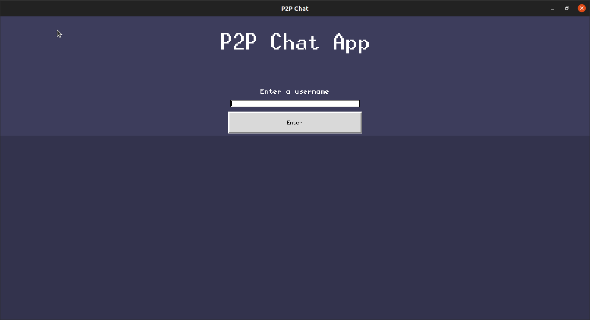
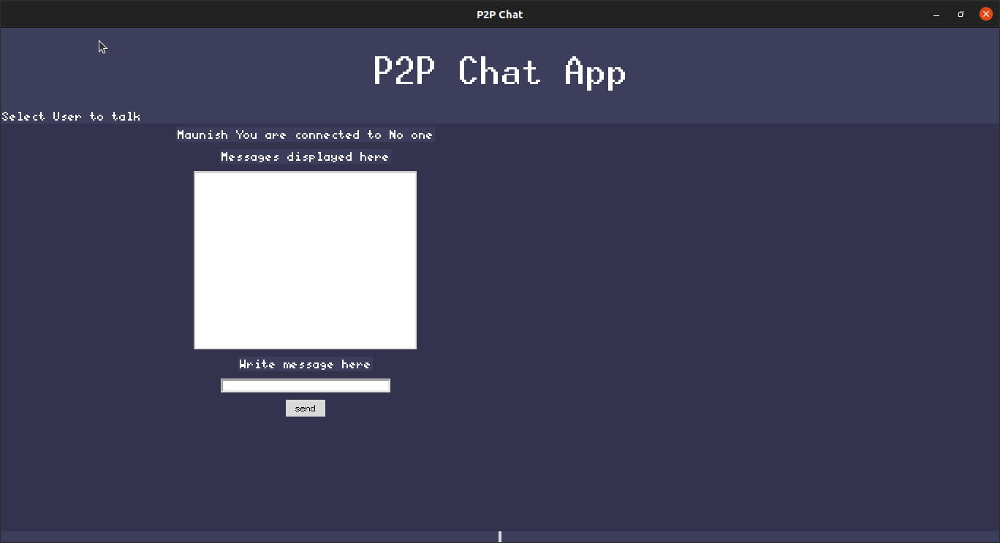
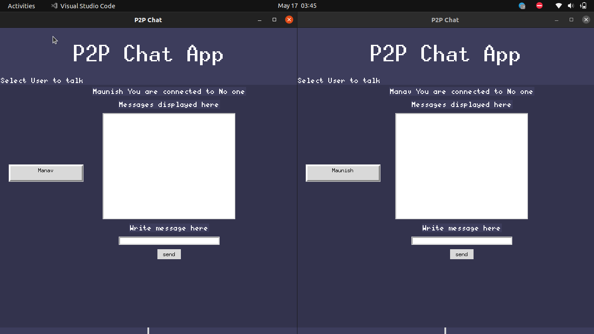
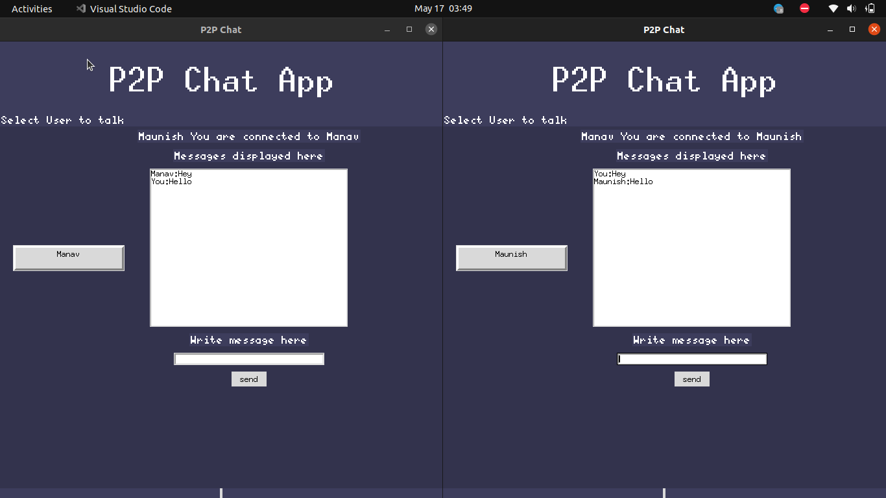
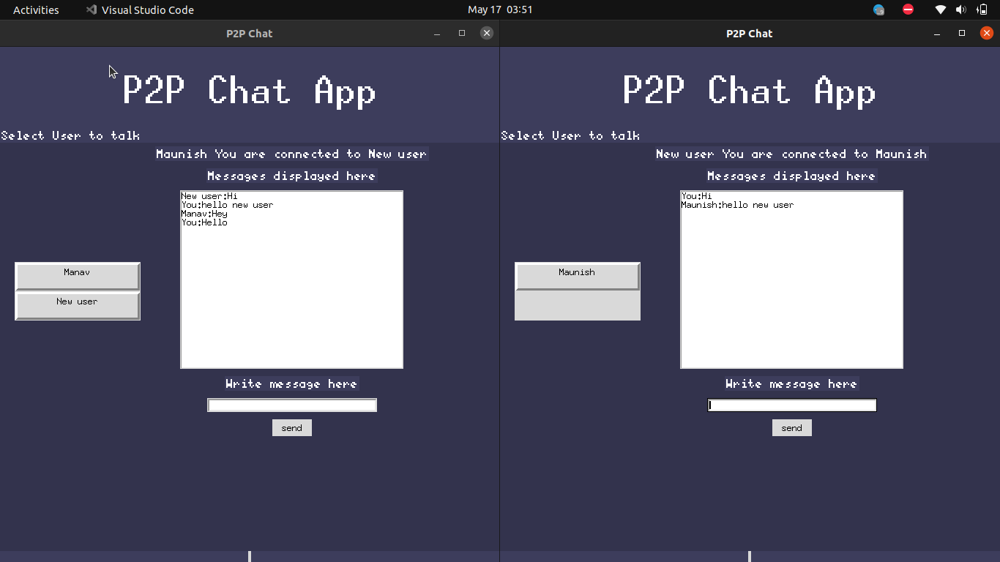

## Please read all the instruction carefully and follow it step by step.

Steps on how to run this code.

-> first run networkmanager.py 

    python networkmanager.py

-> Now run app.py

    python app.py

-> It will open a dialog box like this, Enter your username and click enter.

-> This will show a window like this here on left side you will see all the user in network(currently there are no other user).

-> Now again run app.py in another terminal, and this time use a different user name.

-> Now bring both the window side by side and you will be able to see one user in each window.

-> Now before sending any message you need to click on the user you want to send the message to, so please click on the button on left on each window.

-> Now you can start writting message in the window and press send to send message to each other.

-> If you want to add more users just run app.py again. (just remember to click on the user you want to talk to)

